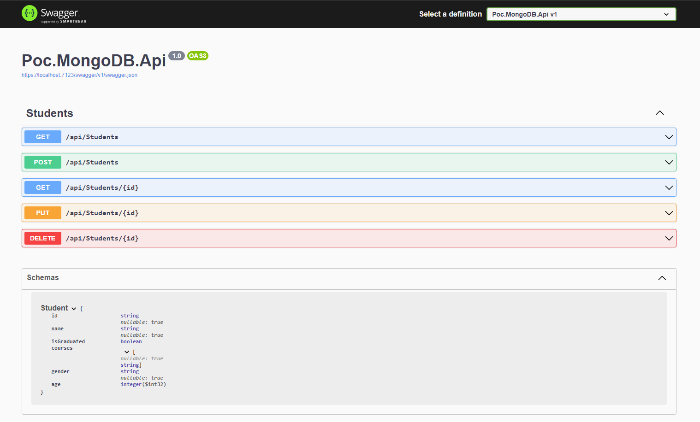
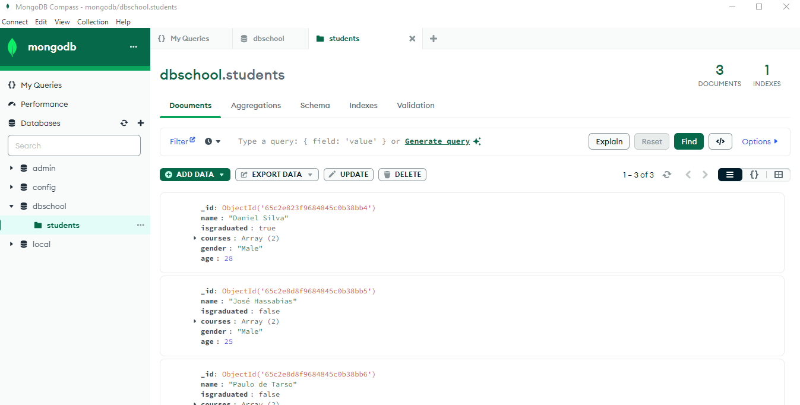
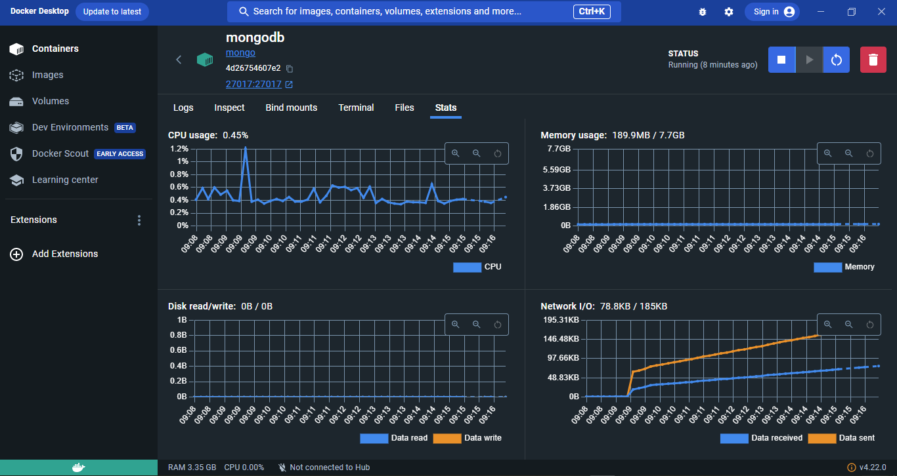

<h2 align="center">
:small_red_triangle_down: POC - API ASP.NET Core with MongoDB  
</h2>

<h2 align="center">
Bootcamp everis Fullstack Developer by Digital Innovation One
</h2>

  

  

This repository was created for learning purposes. It's a POC (Proof of Concept) to implement a CRUD API to connect with a MongoDB database.

## :cloud: Swagger

  

## :cloud: Compass

  

## :cloud: Docker

  

## :small_orange_diamond: License

This project is under MIT license. Open file [LICENSE]( LICENSE.md ) to details. 
The images in this project were made by repo's owner or taken from another repo in the web with the right authorization of use.
